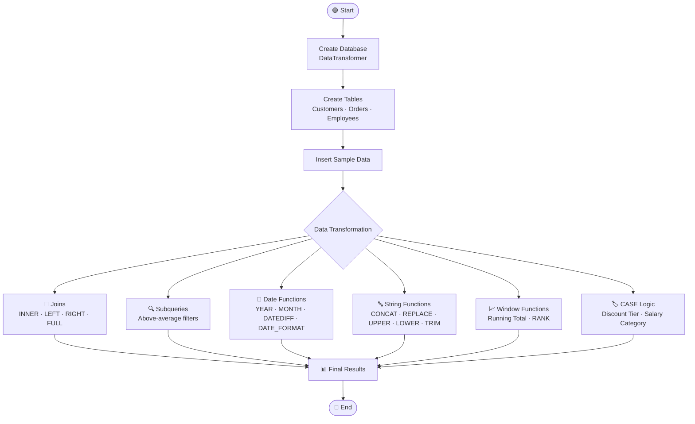

[README (9).md](https://github.com/user-attachments/files/33145934/README.9.md)
<div align="center">

# 🔄 DataTransformer

### A hands-on MySQL project covering Joins, Subqueries, Date & String Functions, Window Functions and CASE logic


</div>

---

## 📑 Table of Contents

- [Problem Statement](#-problem-statement)
- [Objectives](#-objectives)
- [Technologies Used](#-technologies-used)
- [Database Schema](#-database-schema)
- [Program Flow](#-program-flow)
- [Queries & Outputs](#-queries--outputs)
- [How to Run](#-how-to-run)
- [Key Learnings](#-key-learnings)
- [Author](#-author)

---

## 🎯 Problem Statement

Businesses store raw data across multiple tables, such as customers, orders and employees. Raw data on its own is hard to use. It has to be **combined, filtered, cleaned, formatted and categorized** before it can answer real questions like:

- Which customers placed which orders?
- Which customers spend more than the average order value?
- How old is each order? Which month and year was it placed?
- Which employees earn above the company average?
- What discount tier or salary band does a record fall into?

This project builds a small relational database, **`DataTransformer`**, and applies a wide range of SQL transformation techniques to turn raw rows into meaningful, report-ready information.

---

## 🚀 Objectives

- ✅ Create a relational database with **Primary Keys, Foreign Keys and constraints**
- ✅ Insert sample data and understand **duplicate key errors** (Error 1062)
- ✅ Combine tables using **INNER, LEFT, RIGHT and FULL OUTER JOIN** (via `UNION`)
- ✅ Filter data using **subqueries** with `AVG()`
- ✅ Extract and format dates with **`YEAR()`, `MONTH()`, `DATEDIFF()`, `DATE_FORMAT()`**
- ✅ Clean and transform text with **`CONCAT()`, `REPLACE()`, `UPPER()`, `LOWER()`, `TRIM()`**
- ✅ Apply **Window Functions**: running total with `SUM() OVER` and ranking with `RANK() OVER`
- ✅ Categorize data with **`CASE WHEN`** conditional logic

---

## 🛠️ Technologies Used

| Technology | Purpose |
|---|---|
|  | Relational database management system |
|  | Querying and data transformation |
|  | Executing queries in the terminal |
|  | Version control and hosting |

**SQL concepts covered:** DDL · DML · Joins · Subqueries · Aggregate Functions · Date Functions · String Functions · Window Functions · Conditional Expressions

---

## 🗂️ Database Schema

```
                 ┌──────────────────────┐          ┌──────────────────────┐
                 │      Customers       │          │        Orders        │
                 ├──────────────────────┤          ├──────────────────────┤
                 │ 🔑 CustomerID  (PK)  │◄─────────│ 🔑 OrderID     (PK)  │
                 │    FirstName         │   1 : N  │ 🔗 CustomerID  (FK)  │
                 │    LastName          │          │    OrderDate         │
                 │    Email             │          │    TotalAmount       │
                 │    RegistrationDate  │          └──────────────────────┘
                 └──────────────────────┘

                 ┌──────────────────────┐
                 │      Employees       │   (standalone table)
                 ├──────────────────────┤
                 │ 🔑 EmployeeID  (PK)  │
                 │    FirstName         │
                 │    LastName          │
                 │    Department        │
                 │    HireDate          │
                 │    Salary            │
                 └──────────────────────┘
```

### Sample Data

**Customers**

| CustomerID | FirstName | LastName | Email | RegistrationDate |
|:--:|---|---|---|---|
| 1 | John | Doe | john.doe@email.com | 2022-03-15 |
| 2 | Jane | Smith | jane.smith@email.com | 2021-11-02 |

**Orders**

| OrderID | CustomerID | OrderDate | TotalAmount |
|:--:|:--:|---|--:|
| 101 | 1 | 2023-07-01 | 150.50 |
| 102 | 2 | 2023-07-03 | 200.75 |

**Employees**

| EmployeeID | FirstName | LastName | Department | HireDate | Salary |
|:--:|---|---|---|---|--:|
| 1 | Mark | Johnson | Sales | 2020-01-15 | 50000.00 |
| 2 | Susan | Lee | HR | 2021-03-20 | 55000.00 |

---

## 🔁 Program Flow



**Step-by-step**

1. **Setup:** create the `DataTransformer` database and select it.
2. **Schema:** create `Customers`, `Orders` (with a foreign key) and `Employees`.
3. **Load data:** insert sample records into each table.
4. **Join:** combine customers and orders in four different ways.
5. **Subquery:** find customers and employees above the average.
6. **Transform:** format dates, clean text and calculate days since each order.
7. **Analyze:** compute running totals and rankings with window functions.
8. **Categorize:** label records into discount tiers and salary bands with `CASE`.

---

## 📸 Queries & Outputs

> 💡 **Tip:** Take a screenshot of each output and save it in a `screenshots/` folder using the file names below. The images will then show up automatically.

### 1️⃣ Database & Table Creation

```sql
CREATE DATABASE IF NOT EXISTS DataTransformer;
USE DataTransformer;

CREATE TABLE IF NOT EXISTS Customers (
    CustomerID INT PRIMARY KEY AUTO_INCREMENT,
    FirstName VARCHAR(50) NOT NULL,
    LastName VARCHAR(50) NOT NULL,
    Email VARCHAR(100) NOT NULL,
    RegistrationDate DATE NOT NULL
);
```


> ⚠️ **Note:** Re-inserting `CustomerID = 1` produces `ERROR 1062 (23000): Duplicate entry '1' for key 'customers.PRIMARY'`. This happens because the primary key must be unique. It shows the table already contains that row, and the constraint is working as intended.

---

### 2️⃣ INNER JOIN: only matching records

```sql
SELECT o.OrderID, o.OrderDate, o.TotalAmount,
       c.CustomerID, c.FirstName, c.LastName, c.Email
FROM Orders o
INNER JOIN Customers c ON o.CustomerID = c.CustomerID;
```


```
+---------+------------+-------------+------------+-----------+----------+----------------------+
| OrderID | OrderDate  | TotalAmount | CustomerID | FirstName | LastName | Email                |
+---------+------------+-------------+------------+-----------+----------+----------------------+
|     101 | 2023-07-01 |      150.50 |          1 | John      | Doe      | john.doe@email.com   |
|     102 | 2023-07-03 |      200.75 |          2 | Jane      | Smith    | jane.smith@email.com |
+---------+------------+-------------+------------+-----------+----------+----------------------+
```

---

### 3️⃣ LEFT JOIN: all customers, with or without orders

```sql
SELECT c.CustomerID, c.FirstName, c.LastName, c.Email,
       o.OrderID, o.OrderDate, o.TotalAmount
FROM Customers c
LEFT JOIN Orders o ON c.CustomerID = o.CustomerID;
```


---

### 4️⃣ RIGHT JOIN: all orders, with or without customers

```sql
SELECT o.OrderID, o.OrderDate, o.TotalAmount,
       c.CustomerID, c.FirstName, c.LastName
FROM Orders o
RIGHT JOIN Customers c ON o.CustomerID = c.CustomerID;
```


---

### 5️⃣ FULL OUTER JOIN: simulated using `UNION`

MySQL has no `FULL OUTER JOIN`, so `LEFT JOIN ∪ RIGHT JOIN` is used instead.

```sql
SELECT c.CustomerID, c.FirstName, c.LastName, o.OrderID, o.OrderDate, o.TotalAmount
FROM Customers c LEFT JOIN Orders o ON c.CustomerID = o.CustomerID
UNION
SELECT c.CustomerID, c.FirstName, c.LastName, o.OrderID, o.OrderDate, o.TotalAmount
FROM Customers c RIGHT JOIN Orders o ON c.CustomerID = o.CustomerID;
```


---

### 6️⃣ Subquery: customers with an order above the average

```sql
SELECT DISTINCT c.CustomerID, c.FirstName, c.LastName
FROM Customers c
JOIN Orders o ON c.CustomerID = o.CustomerID
WHERE o.TotalAmount > (SELECT AVG(TotalAmount) FROM Orders);
```


```
+------------+-----------+----------+
| CustomerID | FirstName | LastName |
+------------+-----------+----------+
|          2 | Jane      | Smith    |
+------------+-----------+----------+
```

---

### 7️⃣ Subquery: employees earning above the average salary

```sql
SELECT EmployeeID, FirstName, LastName, Salary
FROM Employees
WHERE Salary > (SELECT AVG(Salary) FROM Employees);
```


```
+------------+-----------+----------+----------+
| EmployeeID | FirstName | LastName | Salary   |
+------------+-----------+----------+----------+
|          2 | Susan     | Lee      | 55000.00 |
+------------+-----------+----------+----------+
```

---

### 8️⃣ Date Functions

```sql
-- Extract year and month
SELECT OrderID, OrderDate, YEAR(OrderDate) AS OrderYear, MONTH(OrderDate) AS OrderMonth
FROM Orders;

-- Days since each order
SELECT OrderID, OrderDate, DATEDIFF(CURRENT_DATE(), OrderDate) AS DaysSinceOrder
FROM Orders;

-- Custom date format
SELECT OrderID, OrderDate, DATE_FORMAT(OrderDate, '%d-%b-%Y') AS FormattedOrderDate
FROM Orders;
```

| Year / Month | Days Since Order | Formatted Date |
|:--:|:--:|:--:|
|  |  |  |

```
+---------+------------+--------------------+
| OrderID | OrderDate  | FormattedOrderDate |
+---------+------------+--------------------+
|     101 | 2023-07-01 | 01-Jul-2023        |
|     102 | 2023-07-03 | 03-Jul-2023        |
+---------+------------+--------------------+
```

---

### 9️⃣ String Functions

```sql
SELECT CustomerID, CONCAT(FirstName, ' ', LastName) AS FullName FROM Customers;
SELECT CustomerID, REPLACE(FirstName, 'John', 'Jonathan') AS ModifiedFirstName FROM Customers;
SELECT CustomerID, UPPER(FirstName) AS UpperFirstName, LOWER(LastName) AS LowerLastName FROM Customers;
SELECT CustomerID, TRIM(Email) AS CleanedEmail FROM Customers;
```

| CONCAT | REPLACE | UPPER / LOWER | TRIM |
|:--:|:--:|:--:|:--:|
|  |  |  |  |

---

### 🔟 Window Functions

```sql
-- Running total of order amounts
SELECT OrderID, CustomerID, OrderDate, TotalAmount,
       SUM(TotalAmount) OVER (ORDER BY OrderDate, OrderID) AS RunningTotal
FROM Orders;

-- Rank orders by amount (highest first)
SELECT OrderID, CustomerID, TotalAmount,
       RANK() OVER (ORDER BY TotalAmount DESC) AS AmountRank
FROM Orders;
```


```
+---------+------------+------------+-------------+--------------+
| OrderID | CustomerID | OrderDate  | TotalAmount | RunningTotal |
+---------+------------+------------+-------------+--------------+
|     101 |          1 | 2023-07-01 |      150.50 |       150.50 |
|     102 |          2 | 2023-07-03 |      200.75 |       351.25 |
+---------+------------+------------+-------------+--------------+
```

---

### 1️⃣1️⃣ CASE Expressions: conditional categorization

```sql
-- Discount tier for orders
SELECT OrderID, TotalAmount,
       CASE
           WHEN TotalAmount > 1000 THEN '10% off'
           WHEN TotalAmount > 500  THEN '5% off'
           ELSE 'No Discount'
       END AS DiscountTier
FROM Orders;

-- Salary category for employees
SELECT EmployeeID, FirstName, LastName, Salary,
       CASE
           WHEN Salary >= 60000 THEN 'High'
           WHEN Salary >= 50000 THEN 'Medium'
           ELSE 'Low'
       END AS SalaryCategory
FROM Employees;
```


---

## ▶️ How to Run

```bash
# 1. Clone the repository
git clone https://github.com/<your-username>/DataTransformer.git
cd DataTransformer

# 2. Log in to MySQL
mysql -u root -p

# 3. Run the script
mysql> SOURCE Tirth_2.sql;
```

**Requirements:** MySQL 8.0 or later (window functions need 8.0+).

---

## 📚 Key Learnings

- Primary keys prevent duplicate records, and foreign keys keep related tables consistent.
- Each join type answers a different question: matching rows only, all customers, or all orders.
- Subqueries make it easy to compare each row against an aggregate such as an average.
- Date and string functions turn raw values into clean, readable output.
- Window functions calculate running totals and ranks without collapsing rows.
- `CASE` adds business logic such as discount tiers and salary bands directly in SQL.

---

## 👨‍💻 Author

<div align="center">

**Tirth**

[](https://github.com/)
[](https://www.linkedin.com/)

⭐ If you found this project helpful, please give it a star!

</div>
